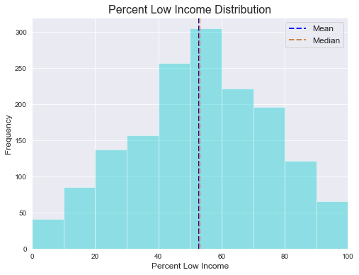

# Great Schools Ratings: Do Majority vs. Minority Low Income Schools Have Different Test Outcomes?

## Background

I discovered the greatschools.org website and rating system in an unorthodox way: through real estate. Zillow and other major home search apps show schools and their corresponding GreatSchools rating under each listing. Through my real estate experience I've learned the importance of schools in home values, and GreatSchools seems to have cornered the market in the K-12 rating market.

Back to the school ratings: I strongly believe in equality in the K-12 market. Children should receive an education up to state standards no matter which public school they attend. I was especially interested to compare the outcomes of schools with more lower income students to those with fewer low income students, specifically whether there is a difference between the mean test score rating of high schools with majority low income students (>50% low income) vs. high schools with minority low income students (<50% low income).

## Methodology

My methodology for the project is to build a web scraper to scrape the greatschools.org website, derive insights through exploratory data analysis, and form a consclusion via a statistical test. I will use a variety of tools including Python, Jupyter Notebooks, VSCode, Git, Docker, MongoDB, Requests, BeautifulSoup, Json, Matplotlib, Seaborn, Numpy, Pandas, and the stats module of Scipy.

## Data and Process

The data was all scraped from Greatschools.org. I first scraped a list of all the Texas school districts and appended their urls to a list. I then removed any urls that were not actual school districts. I then ran the scraper for each school district, scraping the entire page and inserting it into a MongoDB collection. I parsed it through BeautifulSoup and then turned the scripts into json dictionaries and saved each one as a document in a new MongoDB collection.

After creating a Pandas dataframe with the cleaned scripts, I subsetted the data to select just high school data. I used the flatten method from the flatten_json library to flatten columns and then dropped NaNs. I made the decision to drop charter schools because there was a small number of them and I wanted to focus exclusively on non application based schools. It would be interesting to do a separate study including charter schools.

There were five separate dataframes, because some districts had up to five high schools. I concatenated the five dataframes. I then changed string numbers to floats in the columns I was interested in analyzing. I saved the final dataframe to a csv file.

## Exploratory Data Analysis

Number of Texas high schools sampled: 1588

We can see that the test score rating distribution is normally distributed and that the mean and median are nearly the same (5.33 and 5, respectively).

The median and mean percent of low income students is essentially the same at 53 and 52.77% respectively.

This boxplot shows a pattern where as test score ratings increase, the percentage of lower income students decrease. However, there is an interesting uptick at schools with a test score rating of 10 (the best possible test score rating), the percentage of low income students spike.

This overlapped histogram compares the distribution of test score ratings of majority (>=50% low income) low income schools and minority (<50% low income) low income schools. We can see that the mean test scores are lower for schools with a higher percentage of low income students.

## Statistical Test
I performed a statistical test with the goal of determining whether there was a difference in the mean test score ratings between majority and minority low income schools.

Null hypothesis: There is no difference in mean test score ratings between majority low income schools and minority low income schools.
Alternative hypothesis: There is a difference in mean test score ratings between majority low income schools and minority low income schools.
Alpha: 0.05

I performed a Welch's T Test and obtained a p value below the alpha, rejecting the null hypothesis.

## Reflection of Results

The results are unsurpising. It is a commonly held belief that schools in low income areas have lower testing performance. This could be due to a number of factors including parent education levels, teacher quality, spending per student, percentage of students who are learning English, and even crime rates. It would be interesting to further explore a number of these factors to inch closer to root causes in low test score ratings.

## Technology Stack

Python, Docker, MongoDB, Requests, BeautifulSoup, Json, Pandas, Numpy, Matplotlib, Seaborn, Scipy

## Acknowledgements

Thank you to Juliana Duncan, Dan Rupp, and Broderick Turner for your support throughout this project.
